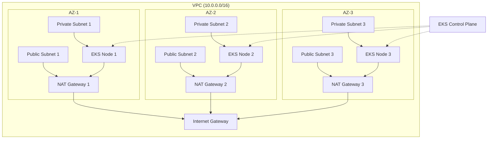

# EKS High Availability Architecture & Production Walkthrough

This document showcases a **production-grade, multi-zone EKS cluster** designed for maximum resilience and high availability.

## 1. High Availability Strategy: The 3-AZ Model

To meet production standards, we have moved beyond a simple multi-AZ setup to a **3-Availability Zone (3-AZ) Architecture**. This ensures that even if an entire AWS Data Center (AZ) goes offline, the cluster retains 66% of its capacity, preventing downtime.

### Key HA Components:
1.  **Triple-AZ Subnets**: 3 Public and 3 Private subnets spread across 3 unique Availability Zones.
2.  **Redundant NAT Gateways**: **3 NAT Gateways** (one per AZ). Unlike a single NAT gateway setup, this prevents a single AZ failure from cutting off internet access for the entire cluster.
3.  **Cross-Zone Node Scaling**: The Managed Node Group is configured with a **Desired Capacity of 3**, ensuring at least one node is always running in each AZ.

---

## 🌟 Visualizing the HA Architecture



## 2. Updated CloudFormation Highlights

### VPC Level ([vpc.yaml](file:///c:/Users/heman/learning/aws/native-eks/templates/vpc.yaml))
-   **CIDRs**: Carefully partitioned to avoid overlap (10.0.0.0/24, 10.0.1.0/24, 10.0.2.0/24 for Public; 10.0.10.0/24, 10.0.11.0/24, 10.0.12.0/24 for Private).
-   **Route Isolation**: Each private subnet has its own route table pointing to its local NAT Gateway, ensuring AZ independence.

### Compute Level ([node-group.yaml](file:///c:/Users/heman/learning/aws/native-eks/templates/node-group.yaml))
-   **Scaling**: `Min: 3`, `Desired: 3`, `Max: 6`.
-   **Distribution**: AWS EKS automatically manages the distribution of nodes across the provided subnets to maintain balance.

## 3. Production Readiness Checklist

| Feature | Status | Description |
| :--- | :--- | :--- |
| **Multi-AZ Control Plane** | ✅ | Managed by AWS EKS. |
| **Multi-AZ Worker Nodes** | ✅ | Spread across 3 AZs. |
| **Outbound HA** | ✅ | 3 NAT Gateways for redundant internet egress. |
| **Scalability** | ✅ | Managed Node Group with Auto-scaling (3 to 6 nodes). |
| **Modular IaC** | ✅ | Nested CloudFormation stacks for ease of management. |

---

## 🚀 Deployment Instructions

1.  **Prerequisities**: Ensure you have an S3 bucket to store the CloudFormation templates (required for Nested Stacks).
2.  **Upload Templates**: 
    ```bash
    aws s3 cp templates/ s3://your-bucket-name/templates/ --recursive
    ```
3.  **Execute Master Stack**:
    ```bash
    aws cloudformation create-stack \
      --stack-name production-eks-ha \
      --template-url https://s3.amazonaws.com/your-bucket-name/templates/master.yaml \
      --capabilities CAPABILITY_IAM CAPABILITY_NAMED_IAM
    ```
